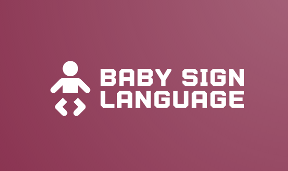

 
  

<h1 align="center"> Baby Sign Language Recognition </h1>
 

 
  

<!-- TABLE OF CONTENTS -->
<h2 id="table-of-contents"> :book: Table of Contents</h2>

  
Table of Contents

  <ol>
    <li><a href="#about-the-project"> ➤ About The Project</a></li>
    <li><a href="#prerequisites"> ➤ Prerequisites</a></li>
    <li><a href="#dataset"> ➤ Dataset</a></li>
    <li><a href="#roadmap"> ➤ Roadmap</a></li>
    <!--<li><a href="#experiments">Experiments</a></li>-->
    <li><a href="#contributors"> ➤ Contributors</a></li>
  </ol>

<!-- ABOUT THE PROJECT -->
<h2 id="about-the-project"> :pencil: About The Project</h2>

 
  This project focuses on recognizing sign language gestures made by babies. It's aimed at understanding and interpreting communication through baby sign language. We explore the gestures infants make to convey their needs and emotions, with the goal of improving parent-infant communication and understanding.

<!--

          
  <!--figcaption>Caption goes here</figcaption-->
<!-- 
 -->

<!-- PREREQUISITES -->
<h2 id="prerequisites"> :fork_and_knife: Prerequisites</h2>

  
  

<!--This project is written in Python programming language.  -->
The following open source packages are used in this project:
* Numpy
* Torch
* Matplotlib
* Scikit-Learn
* Cv2
* CvZone

<!-- DATASET -->
<h2 id="dataset"> :floppy_disk: Dataset</h2>

 
   Our dataset features video clips of infants performing sign gestures alongside their corresponding interpretations. These clips serve as the foundation for training models in recognizing the signs made by babies and understanding their intended meanings. Our mission is to enrich parent-infant communication through the interpretation of baby sign language.

<!--

  

 -->

 **Expressions Included in the Dataset:**

- "milk"
- "eat"
- "I don't know"
- "down"
- "drink"
- "frustrated"
- "I love you"
- "mad/grumpy"
- "mine"
- "mom"
- "potty"
- "sorry" 

<!-- ROADMAP -->
<h2 id="roadmap"> :dart: Roadmap</h2>

 
  This roadmap outlines the journey from collecting data to deploying the baby sign language recognition program:

<ol>
  <li>
    
 
      Data Gathering: We manually collected a diverse set of baby sign language videos from various sources, forming the foundation of our dataset.
    

  </li>
  <li>
    
 
      Data Augmentation: To enrich our dataset, we applied techniques such as rotation and noise addition, enhancing both its size and diversity.
    

  </li>
  <li>
    
 
      Data Preprocessing: This encompassed several essential tasks. We extracted frames from the videos, focusing on the hand gestures. 
    

  </li>
  <li>
    
 
      Model Training: With our dataset primed, we embarked on training deep learning models (CNN) to recognize and interpret baby sign gestures.
    

  </li>
  <li>
    
 
      Real-Time Testing: Our journey culminated in real-world applicability. We tested our trained models using webcam data, allowing us to understand and interpret baby sign language gestures, ultimately enhancing communication between parents and infants.
    

  </li>
</ol>

<!-- CONTRIBUTORS -->

<h2 id="contributors"> :scroll: Contributors</h2>

  :mortar_board: <i>All participants in this project are undergraduate students of <a href="https://acsai.di.uniroma1.it/">Applied Computer Science and Artificial Intelligence</a> <b>@</b> <a href="https://www.uniroma1.it/en/">Sapienza University of Rome</a></i>    
  
  :woman: <b>Rokshana Ahmed</b>  
  &nbsp;&nbsp;&nbsp;&nbsp;&nbsp; Email: <a>ahmed.1994927@studenti.uniroma1.it</a>  
  &nbsp;&nbsp;&nbsp;&nbsp;&nbsp; GitHub: <a href="https://github.com/RoxyDiya">@RoxyDiya</a>  
  
  :woman: <b>Elena Martellucci</b>  
  &nbsp;&nbsp;&nbsp;&nbsp;&nbsp; Email: <a>martellucci.1988602@studenti.uniroma1.it</a>  
  &nbsp;&nbsp;&nbsp;&nbsp;&nbsp; GitHub: <a href="https://github.com/elena-sapienza">@elena-sapienza</a>  

  :woman: <b>Firdaous Hajjaji</b>  
  &nbsp;&nbsp;&nbsp;&nbsp;&nbsp; Email: <a>hajjaji.2006406@studenti.uniroma1.it</a>  
  &nbsp;&nbsp;&nbsp;&nbsp;&nbsp; GitHub: <a href="https://github.com/Firdaous2002">@Firdaous2002</a>  

 
✤ <i>This was the final project for the course AI LAB - Computer Vision at <a href="https://www.uniroma1.it/en/">Sapienza University of Rome</a><i>
